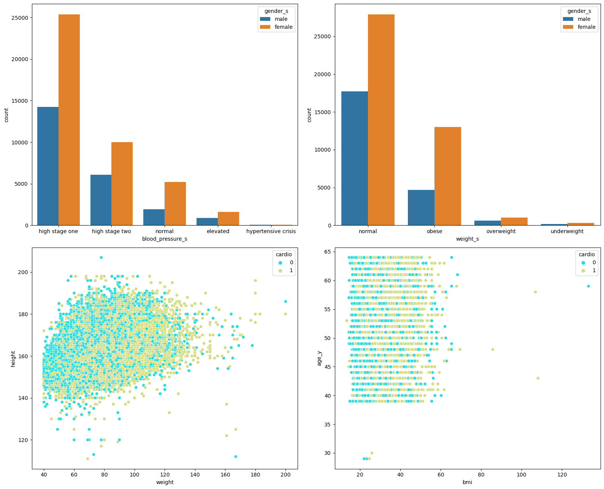
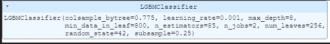

# The Cardio Catch Disease - Detection

Cardio Catch Diseases is a company specialized in detecting heart disease in the early stages. Its business model lies in offering an early diagnosis of cardiovascular disease for a certain price.

Currently, the diagnosis of cardiovascular disease is manually made by a team of specialists. The current accuracy of the diagnosis varies between 55% and 65%, due to the complexity of the diagnosis and also the fatigue of the team who take turns to minimize the risks. The cost of each diagnosis, including the devices and the payroll of the analysts, is around $1,000.00.

The price of the diagnosis, paid by the client, varies according to the precision achieved by the team of specialists.
> - 50%: the patient doesn't need to pay it;
> - If 55%: the patient pays R$ 500,00
> - Each 5% increase: the payment increases R$ 500.00

**The goal is to create a classification tool to improve this diagnosis in order to reduce costs and increase the overall profit.**

## About the dataset

There are 3 types of input features:
> - 70.000 rows
> - Each row contains 11 features and 1 target

> - Columns:
- **Objective**: factual information;
- **Examination**: results of medical examination;
- **Subjective**: information given by the patient.
- **Features**:
    - **Age** | Objective Feature | age | int (days)
    - **Height** | Objective Feature | height | int (cm) |
    - **Weight** | Objective Feature | weight | float (kg) |
    - **Gender** | Objective Feature | gender | categorical code |
    - **Systolic blood pressure** | Examination Feature | ap_hi | int |
    - **Diastolic blood pressure** | Examination Feature | ap_lo | int |
    - **Cholesterol** | Examination Feature | cholesterol | 1: normal, 2: above normal, 3: well above normal |
    - **Glucose** | Examination Feature | gluc | 1: normal, 2: above normal, 3: well above normal |
    - **Smoking** | Subjective Feature | smoke | binary |
    - **Alcohol intake** | Subjective Feature | alco | binary |
    - **Physical activity** | Subjective Feature | active | binary |
    - **Presence or absence of cardiovascular disease** | Target Variable | cardio | binary |
 All of the dataset values were collected at the moment of medical examination.

## Data Filtering

- Consider correct data with weight >= 40;
- Consider correct data with 110 <= height <= 210;
- Consider correct data with 90 <= systolic_pressure <= 210;
- Consider correct data with 65 <= diastolic_pressure <= 150;

## Feature Engineering
Features to create:
- Create BMI (Body Mass Index): weight / ((height * height) / 10000 )
- Create weight_status:
    - underweight: if BMI < 18.5 
    - normal: if (BMI >= 18.5) and (BMI <= 29.4)
    - overweight: if (BMI >= 25) and (BMI <= 29.9)
    - obese: if BMI > 29.9
- Create blood_pressure_s:
    - low: if (systolic <= 90) and (diastolic <= 60)
    - normal: if ((systolic > 90) and (systolic < 120)) and ((diastolic > 60) and (diastolic < 80))
    - elevated: if ((systolic >= 120) and (systolic <= 120)) and (diastolic < 80)
    - high stage one: if ((systolic >= 130) and (systolic <= 139)) or ((diastolic >= 80) and (diastolic <=89))
    - high stage two: if (systolic >= 140) or (diastolic >= 90)
    - hypertensive crisis: if None above satisfied

- Create age_y: age/365
- Create gender_s: map(gender, {1:'female',2:'male'})
- Create cholesterol_s: map(cholesterol, {1: 'normal', 2: 'above normal', 3: 'well above normal'})
- Create gluc_s: map(gluc, {1: 'normal', 2: 'above normal', 3: 'well above normal'})
- Create smoke_s: map(smoke, {1: 'smoking', 0: 'non-smoking'})
- Create alcohol_s: map(alcohol, {1: 'alcoolic', 0: 'non alcoolic'})
- Create active_s:map(active, {1: 'active', 0: 'non active'})

## Univariate Analysis
> Part 1

- HEIGHT of MALE is a little higher than FEMALE;
- CHOLESTEROL concentrated in 1.0;
- ALCOHOL concentrated in 0.0;
- SMOKE concentrated in 0.0;

> Part 2

- FEMALE is concentrated in "high stage one" and "high stage two" in BLOOD PRESSURE;
- FEMALE is concentrated in "OBESE" and "NORMAL" in WEIGHT_S;

## Hipothesis Evaluation

| ID  | Hypothesis                                                                                 | Conclusion |
|:---:|:-----------------------------------------------------------------------------------------|:------------|
 H1 | we have more cardio disease in male individuals then female                   |  TRUE |
 H2 | we have more cardio diseases in individuals with age higher than the average  |  TRUE |
 H3 | In proportion, individuals with cholesterol 2 have more cardio disease than 1 |  TRUE |
 H4 | In proportion, individuals with cholesterol 3 have more cardio disease than 2 |  TRUE |
 H5 | In proportion, individuals with alcohol 1 have more cardio disease than 0     |  FALSE |
 H6 | In proportion, individuals with smoke 1 have more cardio disease than 0       |  FALSE |
 H7 | In proportion, individuals with active 1 have less cardio disease than 0      |  TRUE |
 H8 | In proportion, individuals with glucose 2 have more cardio disease than 1     |  TRUE |
 H9 | In proportion, individuals with glucose 3 have more cardio disease than 2     |  FALSE |

## Multivariate analysis

> Key points:
- GENDER and HEIGHT: moderate positive correlation
- GLUCOSE and CHOLESTEROL: moderate positive correlation
- CARDIO and SYSTOLIC: moderate positive correlation
- CARDIO and DISTOLIC: high positive correlation

## Feature Selection

- Columns selected: ['gender','height','weight','systolic','diastolic','cholesterol','gluc','smoke','alcohol','active','cardio','bmi','weight_s','blood_pressure_s','age_y']

## Train/Test Split
- 25% to TEST
- TARGET: 'cardio'

## Data Preparation
- MinMax Scaler fit on TRAIN: ['height','weight','systolic','diastolic','age_y','bmi']
- MinMax Scaler fit_transform on TEST (avoid data leakage)
- OneHot Encoding: ['weight_s','blood_pressure_s']

## Model

- Tested some models and compared each metric
- Verify Brier Loss: (XGBoost): 0.001572 and  (CatBoost): 0.0025128

## Tuning

- Tested with **RandomizedSearch**

## Calibration

- Verify the probability distributions to predict

## Cross-Validation - all performed models
|Model 	| Precision	|Recall	| F1-Score | Cohen-Kappa|
|:------:|:--------:|:-----:|:--------:|:---------:|
XGBClassifier | 0.9797 +/- 0.0045 | 0.9427 +/- 0.0067 | 0.9608	+/- 0.0034 | 0.9605	+/- 0.0034|
Tuned XGBClassifier | 0.9762 +/- 0.0072 | 0.9453 +/- 0.0092 | 0.9605 +/-0.0046 | 0.9601 +/- 0.0047|
Calibrated XGBClassifier | 0.9722 +/- 0.0022 | 0.9573 +/- 0.0056 | 0.9646 +/- 0.0023 | 0.9644 +/- 0.0023 |

- It was tested with 10 folds

## Business Performance
 With 6354407 transactions (Fraud = 8213 and Non-Fraud = 6362620):

- Receive **25%** of the value of each transaction that is truly detected as fraud (true positives).
- Receive **5%** of the value of each transaction detected as fraud, but the transaction is truly legitimate (false positives).
- Refund **100%** of the value to the customer, for each transaction detected as legitimate, however the transaction is truly a fraud (false negatives).

> Considering the parameters:
- Median amount of a transaction: **$74,871.94** (we're using the median because the amount distribution is highly skewed);
- Portfolio: **6,362,620** transactions (fraudulent + non fraudulent)

- TP amount = 0.25 * median_amount * TP_transactions;
- FP amount = 0.05 * median_amount * FP_transactions;
- FN amount =  median_amount * FN_transactions;

 - Gross Value = TP amount + FP amount - FN amount

- **Best Scenario: `$1,007,761,121.63`**
- **Worst Scenario: `$1,265,581,592.83`**
